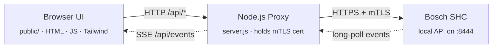

# Bosch SHC - Local Web UI

> **Disclaimer**
> This is an **unofficial, private hobby project** with **no affiliation** to Robert Bosch GmbH or Bosch Smart Home GmbH. "Bosch" and "Smart Home Controller" are trademarks of their respective owners. Use of the local Bosch SHC API is restricted to **private, non-commercial use** per Bosch's terms — see [bosch-shc-api-docs](https://github.com/BoschSmartHome/bosch-shc-api-docs). Use at your own risk; no warranty (see [LICENSE](LICENSE)).
> This project was created with the help of AI (Claude Opus 4.7) under the supervision of an experienced software architect.

A small, self-hostable web UI for the **Bosch Smart Home Controller**, built on top of the official [bosch-shc-api-docs](https://github.com/BoschSmartHome/bosch-shc-api-docs).

The UI is bilingual (English / German) — switch languages from the header.

## Architecture



Solid arrows are synchronous request/response, dotted arrows are the live-event channel: `server.js` keeps a long-polling JSON-RPC connection open to the SHC and fans incoming events out to every connected browser via Server-Sent Events.

The proxy is required because browsers cannot present client certificates (mTLS) to third-party hosts — but the SHC requires exactly that.

## Features

**Dashboard**
- Devices grouped by room, with collapsible room sections
- Filter bar (search by name, model, room) and expand/collapse-all buttons
- Per room with a room thermostat: temperature and humidity shown in the room header
- Switchable plugs / lights
- Heating setpoint (RoomClimateControl) including humidity
- Temperature, window/door contact, power consumption, battery status
- Communication-quality indicator (Wi-Fi-strength icon, color-coded)
- Camera controls: privacy mode, push notifications, light (where supported)
- **Live updates** without reload via long polling

**Scenarios**
- Enable/disable automations
- Toggle user defined states

**Security**
- Arm / disarm intrusion detection (full, partial, custom)
- Mute an active alarm
- Toggle user-defined states (Present, Vacation, …)

**Admin** (mirrors the app's *Settings* area)
- Controller overview with firmware and update status
- List and remove mobile devices / clients
- Rename rooms
- Rename or remove devices, with per-device **firmware update status**
- Inspect raw device JSON to see which services and fields a device exposes

**Messages**
- Translated titles for known codes (low battery, update available, …)
- Severity classification derived from `messageCode.category` and `flags`
- Source (device name) and timestamp formatted to your locale
- Collapsible raw-JSON view for details
- Per-message dismissal
- Tab badge showing the count of important messages
- Messages can be activated to also trigger browser notifications

**Authentication (optional)**
- Enabled at setup time — if disabled, the UI is open
- Admin account created during setup; passwords are stored as scrypt hashes with a per-user salt in `auth.json`
- Login issues an `HttpOnly` session cookie that stays valid indefinitely on the same device
- **Users tab** (admin only): create users with an initial password, reset a user's password, delete users — new users and password-reset users are forced to change their password on next login
- **Sessions tab** (admin only): see every active session (device, IP, last activity) and revoke individual sessions on demand
- Admin-only API endpoints (`/api/clients`, device & room rename/delete, user/session management) reject normal users on the server — the UI hides those tabs to match

## Requirements

- **Node.js ≥ 18**
- **OpenSSL** (for the one-time certificate generation — built in on macOS/Linux; on Windows available e.g. via Git Bash)
- Bosch Smart Home Controller (I or II) on the same network, already set up via the Bosch app
- The **system password** of the SHC (the one you chose during initial app setup)

## Installation

```bash
# 1. Install dependencies
npm install

# 2. Start the UI
npm start
# → http://localhost:3000
```

On first run the server has no `config.json` yet and boots into **setup-mode**: open the URL in a browser and a three-step wizard pairs you with the SHC right there.

1. Enter the **SHC IP address**.
2. Press the **front button on the SHC** until the LED blinks (pairing mode), then enter the **system password** and submit.
3. Choose whether to protect the UI with a login. If yes, set the admin username and password.

The wizard writes `certs/client-cert.pem`, `certs/client-key.pem`, `config.json` and (if auth was enabled) `auth.json`. After completion the page reloads and you're in the normal UI.

Prefer the CLI? `npm run setup` runs the same flow interactively in a terminal (since the web wizard only appears on a fresh install).

To change **only the admin login** later — without re-pairing the SHC — run `npm run setup:auth`. It prompts for a new admin username and password, rewrites `auth.json` (keeping non-admin users and clearing all sessions) and enables auth in `config.json` if it wasn't already. It never generates certificates or talks to the controller, so it's also the quickest way to **recover from a forgotten admin password**. (It requires an existing `config.json` — pair via `npm run setup` first.)

`npm start` runs a `prestart` hook that compiles Tailwind CSS from `public/tailwind.src.css` into `public/tailwind.css` (gitignored). The CSS is fully self-hosted — no CDN — and tree-shaken to only the utilities the UI actually uses (~16 KB minified). If you ever serve `public/` without going through `npm start`, run `npm run build:css` first.

| Problem during setup | What's going on |
| --- | --- |
| Wizard step 2: *"SHC registration failed"* | SHC was not in pairing mode (LED not blinking) or the system password is wrong. Press the button again and retry — pairing-mode times out after a few seconds. |
| Wizard step 2: *"certificate generation failed"* | OpenSSL isn't on the server's PATH. Install it (built-in on macOS/Linux; on Windows e.g. via Git Bash) and retry. |
| Wizard never appears | `config.json` already exists. To re-pair, stop the server, delete `config.json`, `auth.json`, and `certs/`, then `npm start` again. |

## Docker

All runtime-writable state (`config.json`, `auth.json`, `certs/`, `messages-archive.ndjson`) is relocated to `BOSCH_SHC_DATA_DIR` — set to `/data` in the image — so it persists on a volume across restarts and image updates. `openssl` (needed for pairing) is included.

```bash
docker compose up -d --build
# → http://localhost:3000  (boots into the setup wizard on first run)
```

Or without compose:

```bash
docker build -t bosch-shc-ui .
docker run -d --name bosch-shc-ui -p 3000:3000 -v bosch-shc-data:/data bosch-shc-ui
```

The SHC is reached over the LAN by its IP, so the default bridge network is enough — no host networking required. The image runs `node server.js` directly (the Tailwind CSS is compiled in a build stage), so the `prestart` build hook and the `tailwindcss` devDependency aren't needed at runtime.

### Home Assistant (HASS OS) add-on

This repo is a **Home Assistant add-on repository** — anyone can add it by URL and install the add-on; no local build on the HA host. The add-on (`bosch-shc-ui/config.yaml`) pulls a prebuilt multi-arch image from GHCR; the image is built from the root `Dockerfile` by `.github/workflows/build-addon.yml`.

**Publishing a version (maintainer):** tag a release so the workflow builds and pushes the image, then make the GHCR package public once:

```bash
git tag v0.0.1 && git push origin v0.0.1
```

This publishes `ghcr.io/benjenjones/bosch-shc-web-ui:0.0.1` for `amd64` and `aarch64` (64-bit Raspberry Pi). The git tag (`v0.0.1`) must match the `version` in `bosch-shc-ui/config.yaml`. The first time, set the package visibility to **Public** under the repo's *Packages* so users can pull without authentication.

**Installing (users):**

1. **Settings → Add-ons → Add-on Store → ⋮ → Repositories** and add
   `https://github.com/BenjenJones/bosch-shc-web-ui`.
2. Open **Bosch SHC Web UI → Install**, then **Start**.
3. Open `http://<home-assistant-ip>:3000` and run the pairing wizard.

The Supervisor provides and persists `/data` automatically, so pairing survives add-on restarts and updates.

## Demo mode

Want to explore the UI without owning a Smart Home Controller (or any devices)? Run:

```
npm run demo
```

This starts a self-contained **demo SHC** (`demo/shc-server.js`) that mimics the real controller's `/smarthome/*` HTTP API, then boots the normal UI server pointed at it via a temporary `shcProtocol: 'http'` config — so `server.js` carries no demo-specific code; the abstraction is the HTTP interface itself. It listens on a **separate port (3001 by default, override with `BOSCH_SHC_DEMO_PORT`)** so it can run alongside a real instance on 3000. No real `config.json`, certificates or login are required. The dataset covers **one of every device model** (thermostats, contacts, shutters, lights, plugs, smoke/motion/water sensors, Twinguard, intrusion system, …) plus automations spanning every trigger/condition/action type, scenarios, user-defined states and active/archived messages.

Everything is interactive: toggling a plug, moving a setpoint, arming the alarm or renaming a room all persist **in memory** for the lifetime of the process (a restart resets to the dataset on disk, which is never modified). It's a self-contained playground for screenshots, UI development and trying things out.

### The demo dataset

The committed dataset lives in [`demo/dataset/`](demo/dataset/) (`devices.json`, `services.json`, `rooms.json`, `scenarios.json`, `automations.json`, `userdefinedstates.json`, `messages.json`, `messages-archive.json`) and is what `npm run demo` loads. It is **anonymized and curated** — one device per `deviceModel`, real device/state IDs replaced with deterministic placeholders, device names genericized, free-text push messages scrubbed.

It is generated from real SHC exports placed under `examples/` (which are **gitignored** — they come from a real system and are never committed):

```
node demo/build-dataset.js   # or: npm run demo:build
```

Drop your own `examples/devices.json` + `examples/services.json` (and optionally `automations.json` / `scenarios.json`, or the `02_*`-prefixed variants) there, re-run the build, and the dataset regenerates. The service states are borrowed from the real `services.json` as per-service-id templates; `BatteryLevel` carries no state — exactly like a real SHC, which reports low battery only via `faults` — so battery-powered devices show "OK" without inventing a level.

### Managing users (when auth is enabled)

After signing in as the admin you'll see three additional tabs:

- **Admin** — controller info, rooms, devices, paired Bosch clients
- **Users** — create new users with an initial password (they're forced to change it on first login), reset passwords, delete users
- **Sessions** — view every active session (user, device, IP, last activity) and revoke individual sessions; the revoked device is bounced back to the login screen on its next request

Regular users see only the Dashboard, Scenarios, Security and Messages tabs and can change their own password via the account button in the header.

## Security notes

- Setup uses `rejectUnauthorized: false` because the SHC presents a self-signed certificate. For a hardened deployment, Bosch recommends additional **host/CA pinning** — the required CAs are published in the official repo and can be wired into `server.js` (the `ca:` option of `https.Agent`).
- The certificates in `certs/` are your key to the SHC — don't commit them, don't share them. They are already covered by `.gitignore`.
- The UI server listens on `0.0.0.0:3000` by default (port configurable via `config.json` → `uiPort`). If you don't want it reachable from the LAN, bind it to `127.0.0.1` instead.
- `auth.json` contains password hashes (scrypt, per-user salt) and active session tokens. Treat it like a secret — it's already gitignored. Sessions are persisted so they survive server restarts; revoke a session from the **Sessions** tab to force a device to sign in again.

## Serving over HTTPS

By default the UI is served over plain HTTP. There are two ways to add TLS:

**1. Native HTTPS (no extra software).** Generate a certificate for the UI and point `config.json` at it:

```json
"uiTls": {
  "certPath": "certs/ui-cert.pem",
  "keyPath":  "certs/ui-key.pem"
}
```

Paths may be relative (resolved against the project directory) or absolute — both Windows (`C:\\certs\\ui-cert.pem`) and Linux (`/etc/ssl/shc/cert.pem`) absolute paths work. When the block is present (and both paths are set) the server starts on `https://`; remove it to fall back to plain HTTP. The `/api/events` SSE stream works without any extra configuration since there's no proxy buffering in the way.

Generate a self-signed one with OpenSSL (browser will warn):

```bash
openssl req -x509 -newkey rsa:2048 -nodes -days 825 -keyout certs/ui-key.pem -out certs/ui-cert.pem -subj "/CN=shc.home.lan"
```

Note: `uiTls` is independent of the `certPath`/`keyPath` used for the SHC mTLS client cert — don't reuse those here.

**2. Reverse proxy.** Keep the server on `127.0.0.1:3000` and terminate TLS in front. Caddy is the simplest (`reverse_proxy 127.0.0.1:3000` + `tls internal`). With Apache/nginx make sure the `/api/events` SSE endpoint isn't buffered and the proxy timeout is high (e.g. Apache: `ProxyPass / http://127.0.0.1:3000/ flushpackets=on` + `ProxyTimeout 3600`).

## Bosch licensing

The client id `oss_bosch_shc_web_ui` follows the `oss_…` naming convention required by Bosch's terms. Per Bosch, the SHC API may only be used for **private, non-commercial purposes**.

## Extending

The backend proxy (`server.js`) is intentionally thin — adding a new endpoint usually means adding one entry to `GET_ENDPOINTS` or a single new route. The UI (`public/index.html`) renders generically from the `services` array; further service types can be added inside `renderDeviceCard()` (e.g. `ShutterControl`, `MultiLevelSwitch`, `BinarySwitch`, `IntrusionDetectionControl`).

The translation dictionaries live in `public/i18n/de.json` and `public/i18n/en.json`; add new keys to both.

For frontend iteration, `npm run watch:css` rebuilds `public/tailwind.css` on every change to `public/index.html` or `public/app.js` so new utility classes show up without restarting the server.

## Troubleshooting

| Problem                              | Possible cause                                                                                             |
| ------------------------------------ | ---------------------------------------------------------------------------------------------------------- |
| Setup: `401 Unauthorized`            | wrong system password                                                                                      |
| Setup: `400 Bad Request`             | SHC not in pairing mode, or client id already taken                                                        |
| Server start: `EADDRINUSE`           | port 3000 already in use — change `uiPort` in `config.json`                                                |
| Server start: `auth.json is missing` | `authEnabled` is true in `config.json` but `auth.json` was deleted — re-run `npm run setup`                |
| UI loads but no devices              | inspect `/api/devices` in the browser DevTools → Network                                                   |
| Live indicator red                   | long-polling broke — or the session was revoked; check the server logs / refresh and re-login              |
| Forgot the admin password            | run `npm run setup:auth` — it rewrites the admin in `auth.json`, keeps existing regular users, and clears all sessions, without re-pairing the SHC |
| `503` from SHC on a `PUT`            | usually a wrong payload schema — open the device's *info* (ⓘ) in **Admin** to see the actual service state |

## License

MIT for this wrapper — see [LICENSE](LICENSE). The Bosch SHC API itself is governed by Bosch's terms (see the official repo).

**Exception:** the OpenAPI specs under [`test/openapi/`](test/openapi/) (`*-local-openapi-v3.yml`) are **not** covered by the MIT license. They are verbatim, unmodified copies of Bosch's official API documentation, © Robert Bosch GmbH, licensed under [CC BY-NC-ND 4.0](https://creativecommons.org/licenses/by-nc-nd/4.0/legalcode) and subject to [Bosch's Terms & Conditions](https://github.com/BoschSmartHome/bosch-shc-api-docs#terms-and-conditions). See [`test/openapi/NOTICE.md`](test/openapi/NOTICE.md). They are redistributed verbatim for non-commercial use only, as the contract source for the test suite's mock server.
